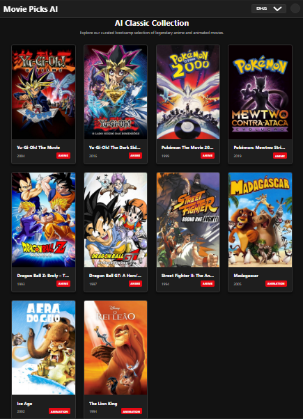

# Creating a Playground Project in Xcode

Project developed during the Santander Bootcamp 2023 - Mobile iOS with Swift, under the guidance of specialist [Robson Moreira](https://github.com/robixnai "Robson Moreira"). 
An adaptive, production-ready frontend module built using semantic **HTML5**, modern **CSS3 grid systems**, and raw **Vanilla JavaScript**. This module forms the companion web interface for the *Santander Bootcamp 2023 - Mobile iOS with Swift*, engineered to exhibit modern clean layouts paired with deep interactive logic layers.

## Core Implementations

* **Dark-First Theme Switcher**: Defaults directly into high-comfort dark theme matrix setups featuring automated vector icon (`fa-moon` / `fa-sun`) context updates.
* **Native i18n Localization Engine**: Clean localization management processing real-time conversions across English (`EN-US`), Brazilian Portuguese (`PT-BR`), and Castilian Spanish (`ES-ES`) without structure reloads.
* **Dynamic Grid Injection**: Leverages optimized `CSS Grid` auto-fill configurations executing responsive adjustments matching Desktop monitors, Tablet devices, and Mobile screens securely.
* **A11y Standards (WCAG Compilant)**: Features `aria-live` state tracking controls, clean contrast boundaries, keyboard focus outlines, skip layout indicators, and clean `aria-labels` for reading software compatibility.

[LICENSE](./LICENSE)
